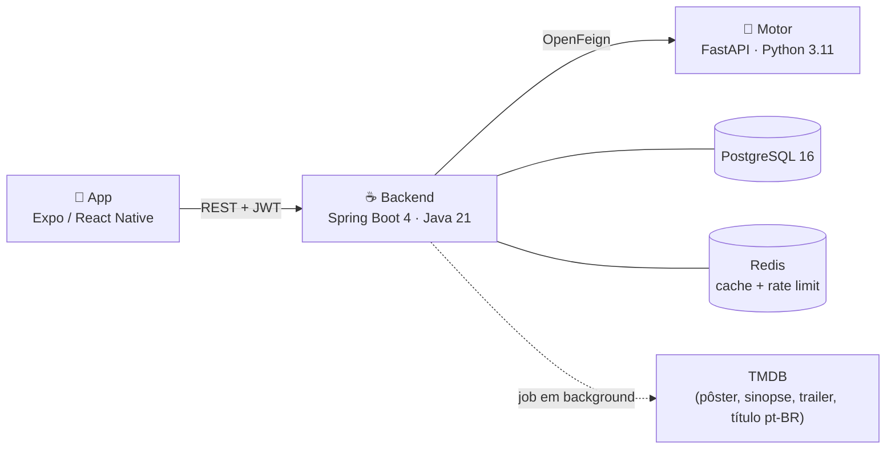

# NextScene

Aplicativo de recomendação de filmes. Você avalia o que já viu, e o sistema
sugere o que provavelmente vai gostar — a partir do comportamento de 200 mil
usuários do MovieLens, não de rótulo de gênero.

Três serviços: um app Expo/React Native, um backend Spring Boot e um motor de
recomendação em FastAPI.



---

## O que você precisa

| Ferramenta | Versão | Para quê |
|---|---|---|
| Docker Desktop | — | Sobe banco, backend e motor |
| Node | 20+ | Rodar o app |
| JDK | 21 | Só para desenvolver o backend fora do Docker |
| Python | 3.11 | Só para re-treinar os modelos |

---

## Subindo o projeto

**1. Configure os segredos.** Copie o exemplo e preencha:

```bash
cp .env.example .env
```

Duas variáveis não têm valor padrão de propósito — a pilha **não sobe** sem elas:

- `JWT_SECRET` — gere com `openssl rand -base64 48`.
- `POSTGRES_PASSWORD` — qualquer senha sua. Sem default de propósito: a porta do
  banco é publicada, e um valor previsível aqui vira porta de entrada.

E uma opcional, mas que muda bastante o resultado:

- `TMDB_API_KEY` — sem ela os filmes ficam sem pôster, sinopse, elenco e trailer.
  Como o catálogo esconde filmes sem sinopse em português **ou** sem elenco (veja
  abaixo), sem a chave as prateleiras ficam quase vazias. Pegue em
  https://www.themoviedb.org/settings/api

**2. Suba a pilha:**

```bash
docker compose up -d
```

Na primeira vez o motor baixa o MovieLens e treina os modelos dentro da imagem
(~2 min). O backend importa o catálogo e começa a enriquecê-lo via TMDB em
background — pôster, sinopse, nota e trailer chegam aos poucos, priorizando os
filmes mais vistos.

Com a pilha no ar, a API se documenta em **http://localhost:8080/swagger-ui.html**
(desligue em produção com `SWAGGER_UI_ENABLED=false`).

**3. Rode o app:**

```bash
cd frontend && cp .env.example .env && npm install && npm run web
```

Para testar no celular com Expo Go, troque a URL no `frontend/.env` pelo IP da
sua máquina na LAN (`http://192.168.x.x:8080/api/v1`) e rode `npm start`.

### Conta de teste

O backend cria uma automaticamente:

```
teste@nextscene.com
123456
```

---

## Rodando os testes

```bash
cd backend && ./mvnw verify
```

```bash
cd recommendation-engine && python -m pytest tests/ -q
```

```bash
cd frontend && npm test && npm run typecheck
```

Os testes do app rodam em dois projetos: `unit` para serviços e utilitários, e
`components` para renderização. Para rodar só um deles:
`npx jest --selectProjects components`.

Os testes do backend sobem um PostgreSQL **e um Redis** reais via Testcontainers
— as migrations são de fato exercitadas, inclusive as extensões `pg_trgm` e
`unaccent`, e o cache/rate limit rodam contra um Redis de verdade. Por isso o
Docker precisa estar rodando.

O CI (`.github/workflows/ci.yml`) roda os três, mais uma verificação que falha o
build se um `.env` voltar a ser versionado.

---

## O que o app faz que não é óbvio

**O catálogo mostra menos filmes que o MovieLens.** O dataset é internacional e
tem muita coisa que o TMDB não conhece em português. Um filme sem sinopse pt-BR
**ou** sem elenco cadastrado vira um card de título estrangeiro, sinopse em
branco e avatares vazios — então ele sai das listagens, da busca e do destaque.
São ~14% do catálogo. O filme **continua abrindo por link direto**, para não
quebrar watchlist e avaliações já feitas.

Quem decide é o job de enriquecimento, não a consulta: uma chamada ao TMDB com
`language=pt-BR` devolve `overview` vazio quando não há tradução, e esse é o
sinal. O veredito fica em `movie.displayable`.

**Excluir um gênero no onboarding vale de verdade.** O veto se aplica às duas
trilhas de recomendação, inclusive às que vêm do motor — que não sabe o que o
usuário rejeitou.

**Trocar e-mail ou senha encerra a sessão.** O token carrega o e-mail nas claims
e o filtro de autenticação monta o usuário a partir delas, sem ir ao banco;
manter a sessão deixaria o token mentindo até vencer. Trocar a senha ainda exige
a senha atual — sem isso, um token roubado (30 min de janela) viraria o
sequestro definitivo da conta.

**O catálogo é cacheado por 10 minutos.** Escrever direto no banco não aparece
na API antes disso. O cache é invalidado quando o job de enriquecimento grava
algo e quando a aplicação sobe — então um deploy nunca serve dados da versão
anterior.

---

## Portas

| Serviço | Porta | Observação |
|---|---|---|
| Backend | 8080 | |
| App (Expo Web) | 8081 | |
| PostgreSQL | 5433 | Só em `127.0.0.1`, para o psql da sua máquina. Em produção, remova o bloco `ports` |
| Motor | — | Sem porta pública: não tem autenticação e só o backend precisa alcançá-lo |
| Redis | — | Sem porta pública: cache do catálogo e rate limit de login/cadastro, só o backend precisa alcançá-lo |

---

## Modelo completo (opcional)

Por padrão o motor usa o `ml-latest-small` (100 mil avaliações), treinado dentro
da imagem. Para usar o dataset completo — 32 milhões de avaliações, recomendações
melhores:

```bash
cd recommendation-engine && ENV=production python -m src.train_pipeline --skip-tmdb
```

```bash
docker compose -f docker-compose.yml -f docker-compose.full-model.yml up -d
```

O override monta os artefatos por volume porque treinar sobre o ml-latest exige
baixar 335 MB de dataset — custo que não faz sentido impor a todo build.

O motor carrega ~275 MB. O SVD e o DataFrame de avaliações (~1 GB) só entrariam
em memória pelo endpoint de avaliação do modelo — que este override **desliga**,
porque roda com `ENV=production`. Nenhum caminho do app passa por ele. Veja
[docs/project_overview.md](docs/project_overview.md#o-motor-de-recomendação).

---

## Problemas comuns

**A aplicação não sobe, erro sobre `JWT_SECRET`.** É intencional: não há valor
padrão para segredo. Defina no `.env`.

**O app mostra "Não foi possível conectar ao servidor".** O `EXPO_PUBLIC_API_URL`
em `frontend/.env` aponta para `localhost`, que no celular significa o próprio
aparelho. Troque pelo IP da máquina na LAN.

**Filmes sem pôster e com nota 0.** O enriquecimento via TMDB roda em background,
em lotes, priorizando os mais bem avaliados. Leva algumas horas para o catálogo
todo. Sem `TMDB_API_KEY`, nunca acontece.

**Nenhum filme tem botão de trailer, mesmo depois do enriquecimento.** Acontece
em bancos de desenvolvimento que já rodaram uma versão anterior do backend: o
job marca `enriched_at` ao processar um filme e nunca o revisita, então filmes
enriquecidos por um jar antigo — sem a lógica de trailer — ficam presos sem
`trailer_key`. Devolva-os à fila:

```bash
docker exec nextscene-db psql -U postgres -d nextscene -c "UPDATE movie SET enriched_at = NULL WHERE vote_count IS NOT NULL AND (trailer_key IS NULL OR trailer_key = '');"
```

Em banco limpo isso não ocorre — a migration V10 já cuida do reprocessamento.

**Fui deslogado logo depois de trocar meu e-mail.** É intencional — veja
"O que o app faz que não é óbvio" acima. O app avisa antes de encerrar.

**Alterei um filme no banco e a API não mudou.** Cache de 10 minutos. Para não
esperar, reinicie o backend (`docker compose restart backend`): a limpeza roda
na subida.

**Container do motor reiniciando.** Verifique os logs com
`docker compose logs recommendation-engine`. Se os modelos não estiverem no
lugar, rode o pipeline de treino ou volte ao padrão (`docker compose up -d` sem
o override).

---

## Gerando o app para distribuição

O `expo start` serve para desenvolver. Para um binário instalável:

```bash
cd frontend && npx eas build --profile preview --platform android
```

Os perfis ficam em [`frontend/eas.json`](frontend/eas.json). O identificador do
app é `io.nextscene.app` nas duas plataformas (`app.json`).

> ⚠️ O perfil `production` aponta `EXPO_PUBLIC_API_URL` para
> `https://api.nextscene.io/api/v1`, que é **um placeholder**. Troque pelo
> domínio real antes do primeiro build de produção — a URL é embutida no bundle
> em build time e não dá para mudar depois sem rebuildar.

---

## Documentação

- [docs/project_overview.md](docs/project_overview.md) — arquitetura, como a
  recomendação funciona, modelo de dados, endpoints e decisões de projeto
- Contrato da API, com a pilha no ar: `http://localhost:8080/swagger-ui.html`

> A revisão técnica (`docs/code-review-2026-07.md`) e o rastreamento de
> pendências (`docs/pendencias.md`) são documentos de trabalho e ficam fora do
> versionamento — veja o `.gitignore`.
