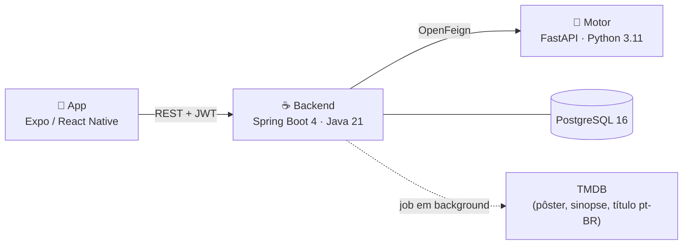

# NextScene

Aplicativo de recomendação de filmes. Você avalia o que já viu, e o sistema
sugere o que provavelmente vai gostar — a partir do comportamento de 200 mil
usuários do MovieLens, não de rótulo de gênero.

Três serviços: um app Expo/React Native, um backend Spring Boot e um motor de
recomendação em FastAPI.



---

## O que você precisa

| Ferramenta | Versão | Para quê |
|---|---|---|
| Docker Desktop | — | Sobe banco, backend e motor |
| Node | 20+ | Rodar o app |
| JDK | 21 | Só para desenvolver o backend fora do Docker |
| Python | 3.11 | Só para re-treinar os modelos |

---

## Subindo o projeto

**1. Configure os segredos.** Copie o exemplo e preencha:

```bash
cp .env.example .env
```

Duas variáveis não têm valor padrão de propósito:

- `JWT_SECRET` — **a aplicação não sobe sem ela**. Gere com `openssl rand -base64 48`.
- `TMDB_API_KEY` — opcional, mas sem ela os filmes ficam sem pôster, sinopse e
  título em português. Pegue em https://www.themoviedb.org/settings/api

**2. Suba a pilha:**

```bash
docker compose up -d
```

Na primeira vez o motor baixa o MovieLens e treina os modelos dentro da imagem
(~2 min). O backend importa o catálogo e começa a enriquecê-lo via TMDB em
background.

**3. Rode o app:**

```bash
cd frontend && cp .env.example .env && npm install && npm run web
```

Para testar no celular com Expo Go, troque a URL no `frontend/.env` pelo IP da
sua máquina na LAN (`http://192.168.x.x:8080/api`) e rode `npm start`.

### Conta de teste

O backend cria uma automaticamente:

```
teste@nextscene.com
123456
```

---

## Rodando os testes

```bash
cd backend && ./mvnw verify
```

```bash
cd recommendation-engine && python -m pytest tests/ -q
```

```bash
cd frontend && npm test && npm run typecheck
```

Os testes do app rodam em dois projetos: `unit` para serviços e utilitários, e
`components` para renderização. Para rodar só um deles:
`npx jest --selectProjects components`.

Os testes do backend sobem um PostgreSQL real via Testcontainers — as migrations
são de fato exercitadas, inclusive as extensões `pg_trgm` e `unaccent`. Por isso
o Docker precisa estar rodando.

O CI (`.github/workflows/ci.yml`) roda os três, mais uma verificação que falha o
build se um `.env` voltar a ser versionado.

---

## Portas

| Serviço | Porta | Observação |
|---|---|---|
| Backend | 8080 | |
| App (Expo Web) | 8081 | |
| PostgreSQL | 5433 | Mapeada para não conflitar com um Postgres local |
| Motor | — | Sem porta pública: não tem autenticação e só o backend precisa alcançá-lo |

---

## Modelo completo (opcional)

Por padrão o motor usa o `ml-latest-small` (100 mil avaliações), treinado dentro
da imagem. Para usar o dataset completo — 32 milhões de avaliações, recomendações
melhores:

```bash
cd recommendation-engine && ENV=production python -m src.train_pipeline --skip-tmdb
```

```bash
docker compose -f docker-compose.yml -f docker-compose.full-model.yml up -d
```

O override monta os artefatos por volume porque treinar sobre o ml-latest exige
baixar 335 MB de dataset — custo que não faz sentido impor a todo build.

O motor carrega ~275 MB: o SVD e o DataFrame de avaliações só entram em memória
se o endpoint de avaliação do modelo for chamado. Veja
[docs/project_overview.md](docs/project_overview.md#o-motor-de-recomendação).

---

## Problemas comuns

**A aplicação não sobe, erro sobre `JWT_SECRET`.** É intencional: não há valor
padrão para segredo. Defina no `.env`.

**O app mostra "Não foi possível conectar ao servidor".** O `EXPO_PUBLIC_API_URL`
em `frontend/.env` aponta para `localhost`, que no celular significa o próprio
aparelho. Troque pelo IP da máquina na LAN.

**Filmes sem pôster e com nota 0.** O enriquecimento via TMDB roda em background,
em lotes, priorizando os mais bem avaliados. Leva algumas horas para o catálogo
todo. Sem `TMDB_API_KEY`, nunca acontece.

**Container do motor reiniciando.** Verifique os logs com
`docker compose logs recommendation-engine`. Se os modelos não estiverem no
lugar, rode o pipeline de treino ou volte ao padrão (`docker compose up -d` sem
o override).

---

## Documentação

- [docs/project_overview.md](docs/project_overview.md) — arquitetura, como a
  recomendação funciona, modelo de dados, endpoints e decisões de projeto
- [docs/code-review-2026-07.md](docs/code-review-2026-07.md) — revisão técnica
  que originou boa parte do estado atual, com o que ficou pendente
