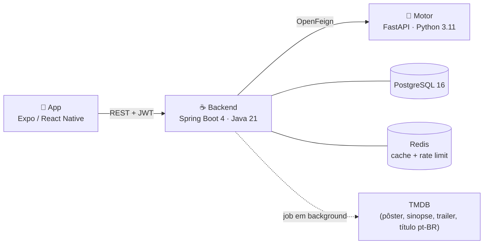

# NextScene

Aplicativo de recomendação de filmes. Você avalia o que já viu, e o sistema
sugere o que provavelmente vai gostar — a partir do comportamento de 200 mil
usuários do MovieLens, não de rótulo de gênero.

Três serviços: um app Expo/React Native, um backend Spring Boot e um motor de
recomendação em FastAPI.



---

## Como funciona

**O catálogo vem do MovieLens e é enriquecido pelo TMDB.** O backend importa
títulos, gêneros e ano; um job em background busca pôster, sinopse em português,
elenco, nota e trailer, em lotes, priorizando os filmes mais vistos.

Filmes que o TMDB não conhece em português — sem sinopse pt-BR ou sem elenco
cadastrado — ficam fora das listagens, da busca e do destaque: o card seria um
título estrangeiro com sinopse em branco e avatares vazios. Eles continuam
acessíveis por link direto, para não quebrar watchlist e avaliações já feitas.

**A recomendação é colaborativa, não por rótulo.** O modelo principal é
item-item: quem gostou disto também gostou daquilo, aprendido das avaliações do
MovieLens. Ele funciona para quem nunca esteve no treino — basta a lista do que
a pessoa avaliou. Quando o histórico é curto demais, o content-based assume,
comparando gêneros, tags e época.

A tela **Para Você** traz duas trilhas com sinais diferentes: as sugestões do
motor e os melhores filmes dos gêneros preferidos. As primeiras posições são
sempre as de maior afinidade; o resto gira a cada atualização, para quem não
gostou de nenhuma não receber a mesma lista de volta.

**As preferências de gênero valem nos dois sentidos.** Os gêneros marcados como
favoritos alimentam a segunda trilha; os excluídos são um veto que se aplica a
todas as sugestões, inclusive às vindas do motor.

**A sessão usa dois tokens.** Um JWT de 30 minutos para as requisições e um
refresh token rotativo de 30 dias, que vale uma única vez. O app renova sozinho
quando o primeiro vence — requisições simultâneas compartilham a mesma renovação
em voo. Trocar e-mail ou senha encerra as sessões abertas, e a troca de senha
pede a senha atual.

**O catálogo é cacheado por 10 minutos** no Redis, compartilhado entre
instâncias. A invalidação acontece quando o enriquecimento grava algo novo e na
subida da aplicação.

Detalhes de arquitetura, modelo de dados e decisões de projeto estão em
[docs/project_overview.md](docs/project_overview.md).

---

## O que você precisa

| Ferramenta | Versão | Para quê |
|---|---|---|
| Docker Desktop | — | Sobe banco, backend e motor |
| Node | 20+ | Rodar o app |
| JDK | 21 | Só para desenvolver o backend fora do Docker |
| Python | 3.11 | Só para re-treinar os modelos |

---

## Subindo o projeto

**1. Configure os segredos.** Copie o exemplo e preencha:

```bash
cp .env.example .env
```

Duas variáveis não têm valor padrão — a pilha não sobe sem elas:

- `JWT_SECRET` — gere com `openssl rand -base64 48`.
- `POSTGRES_PASSWORD` — qualquer senha sua.

E uma opcional, que muda bastante o resultado:

- `TMDB_API_KEY` — traz pôster, sinopse em português, elenco e trailer. Sem ela
  o catálogo fica sem esses dados, e as prateleiras ficam quase vazias. Pegue em
  https://www.themoviedb.org/settings/api

**2. Suba a pilha:**

```bash
docker compose up -d
```

Na primeira vez o motor baixa o MovieLens e treina os modelos dentro da imagem
(~2 min). O backend importa o catálogo e começa a enriquecê-lo em background.

Com a pilha no ar, a API se documenta em **http://localhost:8080/swagger-ui.html**
(desligue em produção com `SWAGGER_UI_ENABLED=false`).

**3. Rode o app:**

```bash
cd frontend && cp .env.example .env && npm install && npm run web
```

Para testar no celular com Expo Go, troque a URL no `frontend/.env` pelo IP da
sua máquina na LAN (`http://192.168.x.x:8080/api/v1`) e rode `npm start`.

### Conta de teste

O backend cria uma automaticamente:

```
teste@nextscene.com
123456
```

---

## Rodando os testes

```bash
cd backend && ./mvnw verify
```

```bash
cd recommendation-engine && python -m pytest tests/ -q
```

```bash
cd frontend && npm test && npm run typecheck
```

Os testes do app rodam em dois projetos: `unit` para serviços e utilitários, e
`components` para renderização. Para rodar só um deles:
`npx jest --selectProjects components`.

Os testes do backend sobem um PostgreSQL e um Redis reais via Testcontainers —
as migrations são de fato exercitadas, inclusive as extensões `pg_trgm` e
`unaccent`, e o cache e o rate limit rodam contra um Redis de verdade. Por isso
o Docker precisa estar rodando.

O CI (`.github/workflows/ci.yml`) roda os três, mais uma verificação que falha o
build se um `.env` for versionado.

---

## Portas

| Serviço | Porta | Observação |
|---|---|---|
| Backend | 8080 | |
| App (Expo Web) | 8081 | |
| PostgreSQL | 5433 | Só em `127.0.0.1`, para o psql da sua máquina. Em produção, remova o bloco `ports` |
| Motor | — | Sem porta pública: não tem autenticação e só o backend precisa alcançá-lo |
| Redis | — | Sem porta pública: cache do catálogo e rate limit de login/cadastro |

---

## Modelo completo (opcional)

Por padrão o motor usa o `ml-latest-small` (100 mil avaliações), treinado dentro
da imagem. Para usar o dataset completo — 32 milhões de avaliações, recomendações
melhores:

```bash
cd recommendation-engine && ENV=production python -m src.train_pipeline --skip-tmdb
```

```bash
docker compose -f docker-compose.yml -f docker-compose.full-model.yml up -d
```

O override monta os artefatos por volume porque treinar sobre o ml-latest exige
baixar 335 MB de dataset — custo que não faz sentido impor a todo build. O motor
carrega ~275 MB em memória por worker.

### Re-treino com as avaliações do app

O que os usuários avaliam pode voltar para o modelo, num espaço de ids unificado
com o MovieLens:

```bash
cd recommendation-engine
pip install -r requirements-dev.txt
python scripts/retrain_with_app_ratings.py
```

Treina num diretório temporário, registra RMSE/MAE em
`models_saved/metrics_history.jsonl` e promove os artefatos guardando os
anteriores como backup. Reinicie o motor depois para carregá-los.

---

## Gerando o app para distribuição

O `expo start` serve para desenvolver. Para um binário instalável:

```bash
cd frontend && npx eas build --profile preview --platform android
```

Os perfis ficam em [`frontend/eas.json`](frontend/eas.json) e o identificador do
app é `io.nextscene.app` nas duas plataformas. Antes do build de produção, ajuste
o `EXPO_PUBLIC_API_URL` do perfil `production` para o domínio real da sua API — a
URL é embutida no bundle em build time.

---

## Documentação

- [docs/project_overview.md](docs/project_overview.md) — arquitetura, como a
  recomendação funciona, modelo de dados, endpoints e decisões de projeto
- [recommendation-engine/README-RE.md](recommendation-engine/README-RE.md) —
  o motor por dentro: modelos, treino e API
- Contrato da API, com a pilha no ar: `http://localhost:8080/swagger-ui.html`
