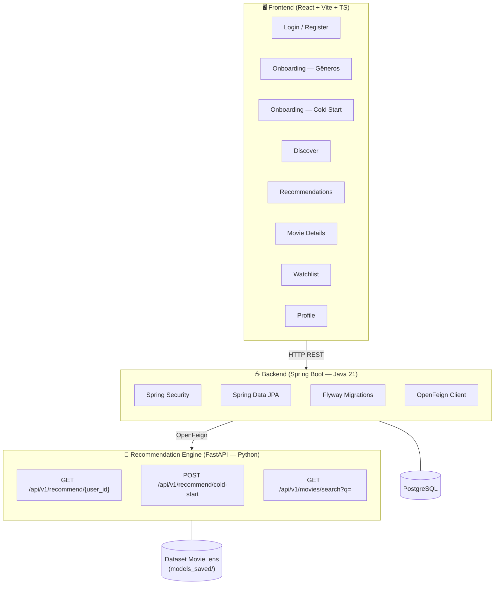
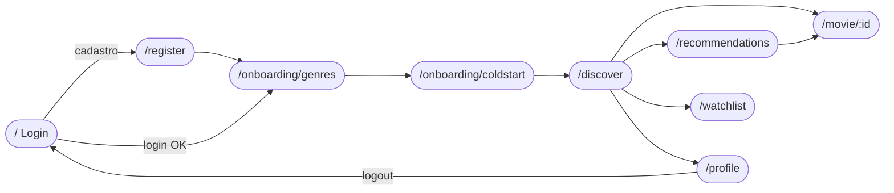
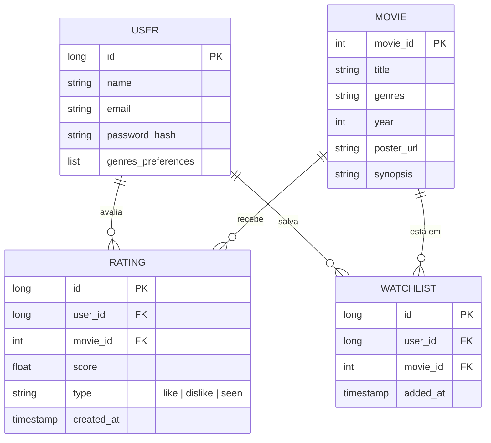

# NextScene — Visão Geral do Projeto

## Arquitetura Geral

---

## Telas do Frontend e Fluxo de Navegação

---

## Endpoints Necessários

### 🐍 Recommendation Engine (FastAPI — já implementado)

| Método | Rota | Status | Descrição |
|--------|------|--------|-----------|
| `GET` | `/api/v1/recommend/{user_id}` | ✅ Implementado | Recomendações personalizadas para usuário existente |
| `POST` | `/api/v1/recommend/cold-start` | ✅ Implementado | Recomendações para novo usuário (onboarding) |
| `GET` | `/api/v1/movies/search?q=` | ✅ Implementado | Busca de filmes por título (autocomplete) |

---

### ☕ Backend Spring Boot (a implementar)

#### Auth
| Método | Rota | Tela Consumidora | Descrição |
|--------|------|-----------------|-----------|
| `POST` | `/api/auth/register` | Register | Cadastro de usuário |
| `POST` | `/api/auth/login` | Login | Autenticação — retorna JWT |
| `POST` | `/api/auth/logout` | Profile | Invalida sessão |

#### Usuário / Perfil
| Método | Rota | Tela Consumidora | Descrição |
|--------|------|-----------------|-----------|
| `GET` | `/api/users/me` | Profile | Dados do usuário autenticado |
| `PUT` | `/api/users/me` | Profile → Editar Perfil | Atualiza nome, e-mail, senha |
| `GET` | `/api/users/me/stats` | Profile | Filmes avaliados, assistidos, favoritos |
| `PUT` | `/api/users/me/genres` | Onboarding Gêneros | Salva gêneros preferidos |

#### Filmes / Catálogo
| Método | Rota | Tela Consumidora | Descrição |
|--------|------|-----------------|-----------|
| `GET` | `/api/movies` | Discover | Listagem com filtro por gênero |
| `GET` | `/api/movies/{id}` | Movie Details | Detalhes do filme (poster, sinopse, elenco…) |
| `GET` | `/api/movies/search?q=` | Discover (search bar) | Proxy para o engine ou busca própria |
| `GET` | `/api/movies/featured` | Discover (destaque) | Filme em destaque (editorial) |

#### Avaliações / Interações
| Método | Rota | Tela Consumidora | Descrição |
|--------|------|-----------------|-----------|
| `POST` | `/api/ratings` | Movie Details (Curti/Não Curti) | Registra avaliação (like/dislike/nota) |
| `GET` | `/api/ratings/me` | Profile / Recommendations | Histórico de avaliações do usuário |

#### Watchlist
| Método | Rota | Tela Consumidora | Descrição |
|--------|------|-----------------|-----------|
| `GET` | `/api/watchlist` | Watchlist | Lista filmes salvos |
| `POST` | `/api/watchlist/{movieId}` | Movie Details (Bookmark) | Adiciona à watchlist |
| `DELETE` | `/api/watchlist/{movieId}` | Watchlist / Movie Details | Remove da watchlist |

#### Recomendações (proxy → Python Engine)
| Método | Rota | Tela Consumidora | Descrição |
|--------|------|-----------------|-----------|
| `GET` | `/api/recommendations` | Recommendations | Chama engine com user_id do JWT |
| `POST` | `/api/recommendations/cold-start` | Onboarding Cold Start | Proxy para engine cold-start |

---

## Status Atual

| Camada | Estado |
|--------|--------|
| Frontend (React) | 🟡 Mockado — sem chamadas reais a API |
| Backend (Spring Boot) | 🔴 Esqueleto vazio — apenas `BackendApplication.java` |
| Recommendation Engine (FastAPI) | 🟢 Implementado — modelos carregados, 3 endpoints prontos |
| Banco de Dados | 🔴 Configurado (JPA + Flyway) mas sem migrations criadas |

> [!WARNING]
> O frontend inteiro usa `mock-data.ts`. Nenhuma página faz chamadas HTTP reais ainda.

> [!IMPORTANT]
> O backend Spring Boot funciona como **BFF (Backend for Frontend)**: autentica o usuário via JWT, persiste dados no PostgreSQL e delega as recomendações ao engine Python via **OpenFeign**.

---

## Modelo de Dados (inferido)

