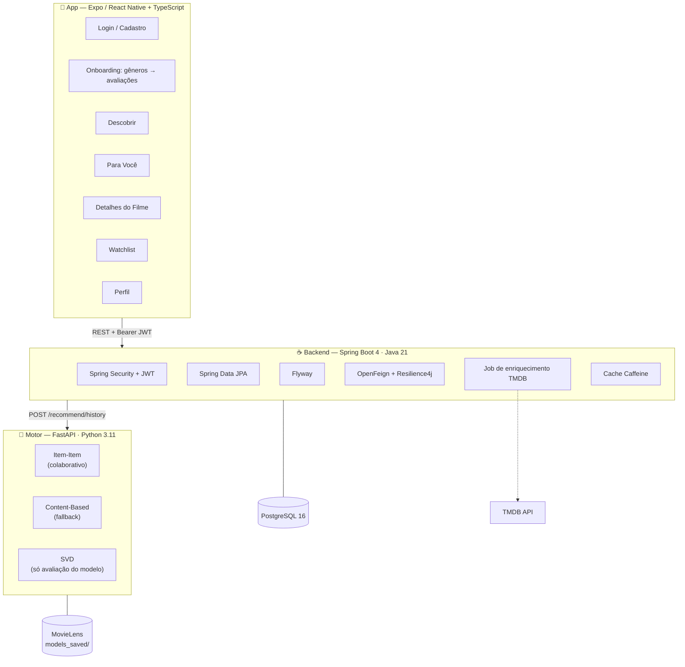
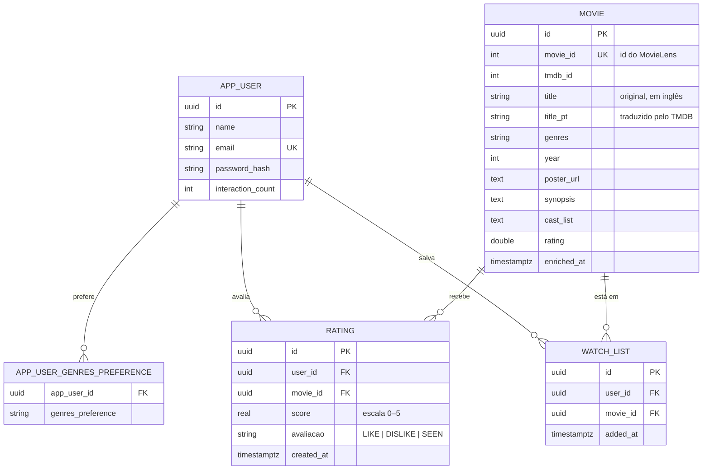

# NextScene — Visão Geral

Como as três partes se encaixam, como a recomendação funciona e por que as
decisões foram tomadas assim. Para rodar o projeto, veja o
[README](../README.md).

---

## Arquitetura



O backend age como **BFF**: autentica, guarda os dados no Postgres e delega a
recomendação ao motor. O motor é **stateless** — não conhece usuários e não
guarda estado sobre eles.

---

## O motor de recomendação

Esta é a parte que mais importa entender, e a que mais mudou.

### Como funciona hoje

A cada pedido de recomendação, o backend lê o histórico de avaliações do usuário
no Postgres e o envia inteiro ao motor:

```mermaid
sequenceDiagram
    participant App
    participant Backend
    participant DB as PostgreSQL
    participant Motor

    App->>Backend: GET /api/recommendations
    Backend->>DB: histórico de avaliações do usuário
    DB-->>Backend: [(movieId, nota), ...]
    Backend->>Motor: POST /api/v1/recommend/history
    Note over Motor: item-item; se vazio,<br/>cai para content-based
    Motor-->>Backend: filmes + score
    Backend->>DB: metadados dos filmes (consulta em lote)
    Backend-->>App: duas trilhas de sugestões
```

Como o motor recebe o histórico a cada chamada, **não precisa conhecer o
usuário nem ser re-treinado** quando alguém novo se cadastra.

### Item-item: o modelo principal

"Quem gostou de A também gostou de B", calculado sobre 32 milhões de avaliações.
A similaridade é entre **filmes**, derivada de comportamento — então recomendar
para alguém novo exige apenas a lista do que essa pessoa avaliou.

Cada filme avaliado vota nos seus vizinhos, com peso pela nota: curtido puxa
para cima, rejeitado empurra para baixo, "já assisti" é neutro. Quem aparece
como vizinho de vários favoritos acumula pontuação.

**Por que não guarda a matriz completa:** seriam 16 mil² floats, ou 1 GB. Quase
tudo é ruído que nunca seria consultado. Guardando os 50 vizinhos mais próximos
de cada filme, o modelo cai para 6 MB.

### Content-based: o fallback

Compara vetores TF-IDF de tags, gêneros e era. Entra quando o item-item não tem
o que dizer — histórico curto demais, ou filmes avaliados que ficaram fora do
índice por serem pouco avaliados no dataset.

**Por que não é o principal:** as tags do MovieLens são esparsas, então o vetor
acaba dominado pelo one-hot de gênero e o modelo degenera em casamento de
rótulo. Medido com o mesmo histórico de entrada:

| | Combinações de gênero distintas em 10 | Exemplos |
|---|---|---|
| Item-item | 8–9 | Matrix, Se7en, Memento, Forrest Gump, Star Wars |
| Content-based | 2 | "Diamanti", "Confidence Girl", "I Am That Man" |

O item-item atravessa gêneros — sugere Forrest Gump e Senhor dos Anéis para um
perfil policial, porque quem tem esse gosto de fato gosta desses filmes.

### SVD: por que continua no projeto

O modelo colaborativo por SVD **não atende os usuários do aplicativo**: ele só
pontua quem estava no conjunto de treino, e ninguém do app está. Permanece
apenas por trás de `GET /api/v1/recommend/{user_id}`, útil para avaliar o modelo
contra usuários do MovieLens.

É ele o responsável pelos 2,3 GB do modelo completo — o `scikit-surprise`
serializa o conjunto de treino inteiro dentro do pickle.

### Piso de popularidade

Filmes com menos de 50 avaliações não entram nas sugestões. Sem esse piso, o
content-based entregava a cauda longa: no `ml-latest` a mediana é 5 avaliações
por filme e 62% têm menos de 10, e esses casam quase perfeitamente com qualquer
perfil porque seu vetor é praticamente só o gênero.

Configurável por `MIN_RATINGS_FOR_RECOMMENDATION`.

### As duas trilhas da tela "Para Você"

| Trilha | Origem |
|---|---|
| **Escolhas da IA** | Motor de recomendação |
| **Dos Seus Gêneros** | Filmes bem avaliados nos gêneros que o usuário escolheu |

São sinais diferentes de propósito. Nenhuma das duas devolve filme que o usuário
já avaliou — avaliação é insumo do algoritmo, não resultado dele.

---

## Modelo de dados



**Chaves são UUID, e a API as expõe como string.** Uma versão anterior truncava
o UUID para caber num `number` do JavaScript, descartando metade dos bits — o id
devolvido não servia para localizar o registro de volta e havia risco de colisão.

**`title` e `title_pt` coexistem.** O motor trabalha com o título original, e a
busca aceita as duas grafias, ignorando acentos: "The Godfather", "O Poderoso
Chefão" e "Poderoso Chefao" chegam ao mesmo filme.

---

## Endpoints

### Backend

Tudo exige `Authorization: Bearer <token>`, exceto onde indicado.

| Método | Rota | Descrição |
|---|---|---|
| `POST` | `/api/auth/register` | Cadastro — público |
| `POST` | `/api/auth/login` | Login — público, com rate limit por IP |
| `POST` | `/api/auth/logout` | Sem efeito no servidor (JWT é stateless) |
| `GET` | `/api/users/me` | Perfil |
| `PUT` | `/api/users/me` | Atualiza nome, e-mail, senha |
| `GET` | `/api/users/me/stats` | Avaliados, assistidos, favoritos |
| `PUT` | `/api/users/me/genres` | Gêneros preferidos |
| `GET` | `/api/movies?genre=&page=&size=` | Catálogo paginado — público |
| `GET` | `/api/movies/{id}` | Detalhes — público |
| `GET` | `/api/movies/search?q=&page=&size=` | Busca bilíngue — público |
| `GET` | `/api/movies/featured` | Destaque — público |
| `POST` | `/api/ratings` | Registra uma avaliação |
| `POST` | `/api/ratings/batch` | Registra várias — usado no onboarding |
| `GET` | `/api/ratings/me` | Histórico |
| `DELETE` | `/api/ratings/{movieId}` | Remove avaliação |
| `GET` | `/api/watchlist` | Lista salvos |
| `POST` | `/api/watchlist/{movieId}` | Adiciona |
| `DELETE` | `/api/watchlist/{movieId}` | Remove |
| `GET` | `/api/recommendations` | Duas trilhas de sugestões |
| `POST` | `/api/recommendations/cold-start` | Sugestões pós-onboarding |
| `GET` | `/actuator/health` | Healthcheck — público |

**Semântica de erro:** 401 é sessão expirada ou ausente (o app desloga e volta
ao login); 403 é autenticado sem permissão; 404 é recurso inexistente.

### Motor

| Método | Rota | Descrição |
|---|---|---|
| `POST` | `/api/v1/recommend/history` | **Usado pelo backend.** Recebe o histórico, devolve sugestões |
| `POST` | `/api/v1/recommend/cold-start` | A partir de filmes curtidos no onboarding |
| `GET` | `/api/v1/recommend/{user_id}` | Só para usuários do MovieLens — avaliação do modelo |
| `GET` | `/api/v1/movies/search?q=&limit=` | Busca no dataset |

---

## Decisões que valem conhecer

**O motor não tem porta publicada.** Não possui autenticação nenhuma e só o
backend precisa alcançá-lo, pela rede interna do compose.

**TMDB roda em background, nunca no caminho da requisição.** Antes cada tela de
recomendação disparava até 20 chamadas HTTP sequenciais ao TMDB, somando dezenas
de segundos de latência. Hoje um job agendado enriquece em lotes, priorizando os
filmes mais bem avaliados — que são os que aparecem primeiro nas telas.

**A imagem do motor se reconstrói sozinha.** `scripts/bootstrap.py` baixa o
MovieLens e treina os modelos durante o build. Dataset e artefatos ficam fora do
Git, e a imagem funciona em qualquer clone limpo.

**Busca por trigrama.** `LIKE '%termo%'` não usa índice B-tree e fazia varredura
completa. Índices GIN com `pg_trgm` sobre a forma sem acento resolvem tanto a
busca por título quanto o filtro por gênero.

**Cache e rate limit são por instância.** Com mais de um nó do backend, o limite
efetivo multiplica e cada nó tem seu próprio cache. Para valer em produção,
precisam de Redis.

---

## Limitações conhecidas

| Limitação | Impacto |
|---|---|
| Catálogo dessincronizado: backend tem 9.742 filmes, motor 80.505 | Sugestões fora do catálogo são descartadas, então a lista pode vir com menos itens |
| Chave TMDB exposta no histórico do Git | Precisa ser rotacionada |
| Sem testes de componente no app | `react-test-renderer` não resolve com React 19; a cobertura é de serviços e cliente HTTP |
| Cache e rate limit em memória | Impedem escalar horizontalmente sem Redis |
| Sem refresh token | A sessão expira em 30 min e exige novo login |
