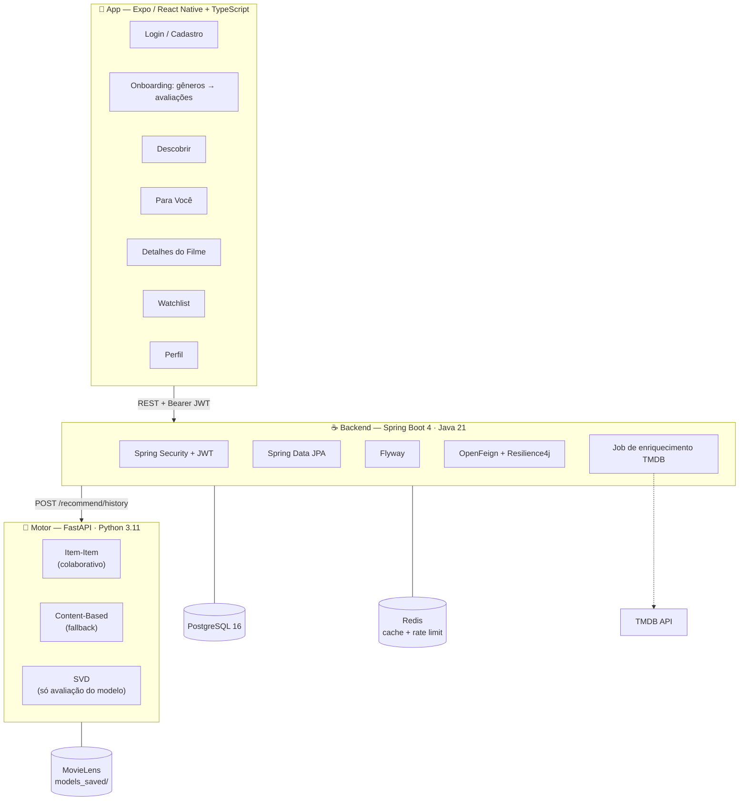
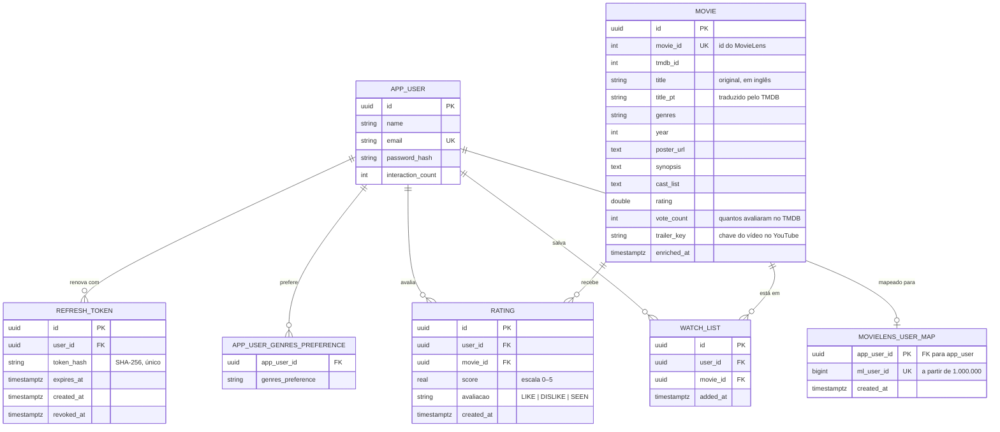

# NextScene — Visão Geral

Como as três partes se encaixam, como a recomendação funciona e por que as
decisões foram tomadas assim. Para rodar o projeto, veja o
[README](../README.md).

---

## Arquitetura



O backend age como **BFF**: autentica, guarda os dados no Postgres e delega a
recomendação ao motor. O motor é **stateless** — não conhece usuários e não
guarda estado sobre eles.

---

## O motor de recomendação

Esta é a parte que mais importa entender, e a que mais mudou.

### Como funciona hoje

A cada pedido de recomendação, o backend lê o histórico de avaliações do usuário
no Postgres e o envia inteiro ao motor:

```mermaid
sequenceDiagram
    participant App
    participant Backend
    participant DB as PostgreSQL
    participant Motor

    App->>Backend: GET /api/v1/recommendations
    Backend->>DB: histórico de avaliações do usuário
    DB-->>Backend: [(movieId, nota), ...]
    Backend->>Motor: POST /api/v1/recommend/history
    Note over Motor: item-item; se vazio,<br/>cai para content-based
    Motor-->>Backend: filmes + score
    Backend->>DB: metadados dos filmes (consulta em lote)
    Backend-->>App: duas trilhas de sugestões
```

Como o motor recebe o histórico a cada chamada, **não precisa conhecer o
usuário nem ser re-treinado** quando alguém novo se cadastra.

### Item-item: o modelo principal

"Quem gostou de A também gostou de B", calculado sobre 32 milhões de avaliações.
A similaridade é entre **filmes**, derivada de comportamento — então recomendar
para alguém novo exige apenas a lista do que essa pessoa avaliou.

Cada filme avaliado vota nos seus vizinhos, com peso pela nota: curtido puxa
para cima, rejeitado empurra para baixo, "já assisti" é neutro. Quem aparece
como vizinho de vários favoritos acumula pontuação.

**Por que não guarda a matriz completa:** seriam 16 mil² floats, ou 1 GB. Quase
tudo é ruído que nunca seria consultado. Guardando os 50 vizinhos mais próximos
de cada filme, o modelo cai para 6 MB.

### Content-based: o fallback

Compara vetores TF-IDF de tags, gêneros e era. Entra quando o item-item não tem
o que dizer — histórico curto demais, ou filmes avaliados que ficaram fora do
índice por serem pouco avaliados no dataset.

**Por que não é o principal:** as tags do MovieLens são esparsas, então o vetor
acaba dominado pelo one-hot de gênero e o modelo degenera em casamento de
rótulo. Medido com o mesmo histórico de entrada:

| | Combinações de gênero distintas em 10 | Exemplos |
|---|---|---|
| Item-item | 8–9 | Matrix, Se7en, Memento, Forrest Gump, Star Wars |
| Content-based | 2 | "Diamanti", "Confidence Girl", "I Am That Man" |

O item-item atravessa gêneros — sugere Forrest Gump e Senhor dos Anéis para um
perfil policial, porque quem tem esse gosto de fato gosta desses filmes.

### SVD: por que continua no projeto

O modelo colaborativo por SVD **não atende os usuários do aplicativo**: ele só
pontua quem estava no conjunto de treino, e ninguém do app está. Permanece
apenas por trás de `GET /api/v1/recommend/{user_id}`, útil para avaliar o modelo
contra usuários do MovieLens.

É ele o responsável pelo peso: o `scikit-surprise` serializa o conjunto de
treino inteiro dentro do pickle, e carregá-lo custa ~10 GB de RAM.

Por isso ele e o DataFrame de avaliações passaram a ser **carregados sob
demanda**, na primeira chamada àquele endpoint. O caminho do aplicativo não paga
nada por eles:

| | Antes | Depois |
|---|---|---|
| Startup do motor | 136 s | 2,3 s |
| RAM em operação | 11,7 GB | 275 MB |
| `hybrid_recommender.joblib` | 1,2 GB | 22 MB |

### Piso de popularidade

Filmes com menos de 50 avaliações não entram nas sugestões. Sem esse piso, o
content-based entregava a cauda longa: no `ml-latest` a mediana é 5 avaliações
por filme e 62% têm menos de 10, e esses casam quase perfeitamente com qualquer
perfil porque seu vetor é praticamente só o gênero.

Configurável por `MIN_RATINGS_FOR_RECOMMENDATION`.

### As duas trilhas da tela "Para Você"

| Trilha | Origem |
|---|---|
| **Escolhas da IA** (`aiPicks`) | Motor de recomendação |
| **Dos Seus Gêneros** (`byGenre`) | Filmes bem avaliados nos gêneros que o usuário escolheu |

São sinais diferentes de propósito. Nenhuma das duas devolve filme que o usuário
já avaliou — avaliação é insumo do algoritmo, não resultado dele.

**As duas passam por `withVariety`.** As quatro primeiras posições saem sempre
(são as de maior pontuação); as seis restantes são sorteadas de um conjunto
maior de candidatos. Sem isso, ambas as trilhas eram determinísticas e o botão
de atualizar devolvia a lista idêntica — quem não gostava de nenhuma sugestão
não tinha como pedir outras.

### As prateleiras da tela "Descobrir"

O Descobrir não passa pelo motor: é curadoria sobre o catálogo do Postgres, com
três faixas horizontais, cada uma com um critério de ordenação declarado no
rótulo.

| Prateleira | `sort` | Ordenação |
|---|---|---|
| **Em Alta** | `popular` | Mais avaliados no TMDB (`vote_count`) |
| **Mais Recentes** | `recent` | Ano decrescente; empate pelos mais vistos |
| **Bem Avaliados** | `rating` | Melhor nota média |

Antes existia uma grade única ordenada por nota, rotulada "Em Alta" — que na
prática eram os melhores filmes de todos os tempos, sempre na mesma ordem. O
rótulo dizia uma coisa e a tela entregava outra. Nota média mede qualidade
percebida, não alcance.

Buscar ou filtrar por gênero troca as prateleiras por uma grade paginada,
ordenada por `popular`. Filmes ainda não enriquecidos têm `vote_count` nulo e vão
para o fim de todas as ordenações (`NULLS LAST`), para não encabeçar a lista sem
pôster.

**O botão de atualizar avança a página das três prateleiras**, em vez de
recarregar a mesma. Como a ordenação é estática, rebuscar a página 0 devolvia os
mesmos vinte títulos e o botão parecia não fazer nada. Ao chegar ao fim do
catálogo, volta ao início. Existe como botão visível, e não só como "puxar para
atualizar": na web não há gesto de puxar.

---

## Modelo de dados



**Chaves são UUID, e a API as expõe como string.** Uma versão anterior truncava
o UUID para caber num `number` do JavaScript, descartando metade dos bits — o id
devolvido não servia para localizar o registro de volta e havia risco de colisão.

**Sessão com refresh token.** O access token dura 30 minutos; o refresh, 30
dias. Cada renovação consome o token apresentado e emite outro — um refresh vale
uma única vez. Apresentar um já consumido é tratado como vazamento e derruba
todos os tokens do usuário.

O refresh é um token opaco guardado no banco, não outro JWT: JWT é auto-contido
e irrevogável sem lista de bloqueio, e é justamente o refresh que dá acesso de
longa duração. Só o hash SHA-256 é armazenado — o token é aleatório e de alta
entropia, então não há o que adivinhar por força bruta que justifique um hash
lento.

**`vote_count` separa popularidade de nota.** Média mede qualidade percebida,
não alcance: um documentário com 60 votos pode ter média 9,0 sem que ninguém
esteja assistindo. O campo vem do TMDB no mesmo payload da sinopse e do pôster,
e é o que sustenta a prateleira "Em Alta".

**`title` e `title_pt` coexistem.** O motor trabalha com o título original, e a
busca aceita as duas grafias, ignorando acentos: "The Godfather", "O Poderoso
Chefão" e "Poderoso Chefao" chegam ao mesmo filme.

**`movielens_user_map` é a ponte para o re-treino.** O motor treina sobre
usuários do MovieLens (inteiros de 1 a ~200 mil); os do app são UUID. Um
usuário só ganha uma linha aqui quando é exportado pela primeira vez para o
re-treino — a maioria nunca chega a ter uma. Ver
[README do motor](../recommendation-engine/README-RE.md#re-treino-com-os-ratings-do-app).

**`avaliacao` tem três estados, e cada um vira uma nota diferente.** `LIKE` →
5.0, `SEEN` → 2.5, `DISLIKE` → 0.0, na escala do MovieLens. O `SEEN` é o sinal
neutro: não puxa recomendação para nenhum lado, mas tira o filme da lista de
candidatos — "já vi, não me ofereça de novo". Hoje só o onboarding oferece esse
botão — oferecê-lo também na tela de detalhes é uma pendência conhecida.

**`trailer_key` guarda só a chave do YouTube**, não a URL inteira — o app monta
`youtube.com/watch?v={key}`. Quando é nulo, o TMDB não conhece trailer para o
filme e **o botão de assistir some da tela**, em vez de cair numa busca por
título, que costumava trazer review ou o filme errado.

---

## Endpoints

### Backend

Tudo exige `Authorization: Bearer <token>`, exceto onde indicado. Contrato
completo, navegável, em `/v3/api-docs` e `/swagger-ui.html` — ligado por padrão
(ambiente é dev); em produção, desligue com `SWAGGER_UI_ENABLED=false`.

| Método | Rota | Descrição |
|---|---|---|
| `POST` | `/api/v1/auth/register` | Cadastro — público |
| `POST` | `/api/v1/auth/login` | Login — público, com rate limit por IP |
| `POST` | `/api/v1/auth/refresh` | Renova a sessão — público, consome e rotaciona o refresh token |
| `POST` | `/api/v1/auth/logout` | Revoga os refresh tokens do usuário |
| `GET` | `/api/v1/users/me` | Perfil |
| `PUT` | `/api/v1/users/me` | Atualiza nome, e-mail, senha |
| `GET` | `/api/v1/users/me/stats` | Avaliados, assistidos, favoritos |
| `PUT` | `/api/v1/users/me/genres` | Gêneros preferidos |
| `GET` | `/api/v1/movies?genre=&sort=&page=&size=` | Catálogo paginado — público. `sort`: `popular`, `recent` ou `rating` (padrão) |
| `GET` | `/api/v1/movies/{id}` | Detalhes — público |
| `GET` | `/api/v1/movies/search?q=&page=&size=` | Busca bilíngue — público |
| `GET` | `/api/v1/movies/featured` | Destaque — público |
| `POST` | `/api/v1/ratings` | Registra uma avaliação |
| `POST` | `/api/v1/ratings/batch` | Registra várias — usado no onboarding |
| `GET` | `/api/v1/ratings/me` | Histórico |
| `GET` | `/api/v1/ratings/{movieId}` | Avaliação de um filme específico — 404 se não avaliado |
| `DELETE` | `/api/v1/ratings/{movieId}` | Remove avaliação |
| `GET` | `/api/v1/watchlist` | Lista salvos |
| `POST` | `/api/v1/watchlist/{movieId}` | Adiciona |
| `DELETE` | `/api/v1/watchlist/{movieId}` | Remove |
| `GET` | `/api/v1/recommendations` | Duas trilhas de sugestões |
| `POST` | `/api/v1/recommendations/cold-start` | Sugestões pós-onboarding |
| `GET` | `/actuator/health` | Healthcheck — público |

**Semântica de erro:** 401 é sessão expirada ou ausente (o app desloga e volta
ao login); 403 é autenticado sem permissão; 404 é recurso inexistente.

### Motor

| Método | Rota | Descrição |
|---|---|---|
| `POST` | `/api/v1/recommend/history` | **Usado pelo backend.** Recebe o histórico, devolve sugestões |
| `POST` | `/api/v1/recommend/cold-start` | A partir de filmes curtidos no onboarding |
| `GET` | `/api/v1/recommend/{user_id}` | Só para usuários do MovieLens — avaliação do modelo |
| `GET` | `/api/v1/movies/search?q=&limit=` | Busca no dataset |
| `GET` | `/` | Healthcheck |

---

## Decisões que valem conhecer

**O motor não tem porta publicada.** Não possui autenticação nenhuma e só o
backend precisa alcançá-lo, pela rede interna do compose.

**TMDB roda em background, nunca no caminho da requisição.** Antes cada tela de
recomendação disparava até 20 chamadas HTTP sequenciais ao TMDB, somando dezenas
de segundos de latência. Hoje um job agendado enriquece em lotes, priorizando os
filmes mais bem avaliados — que são os que aparecem primeiro nas telas.

**A imagem do motor se reconstrói sozinha.** `scripts/bootstrap.py` baixa o
MovieLens e treina os modelos durante o build. Dataset e artefatos ficam fora do
Git, e a imagem funciona em qualquer clone limpo.

**Busca por trigrama.** `LIKE '%termo%'` não usa índice B-tree e fazia varredura
completa. Índices GIN com `pg_trgm` sobre a forma sem acento resolvem tanto a
busca por título quanto o filtro por gênero.

**Cache e rate limit são compartilhados via Redis.** O cache do catálogo
(`movies`, `movieById`, `featuredMovie`) e o contador de tentativas de login
vivem no Redis, não em memória do processo — com mais de um nó do backend,
todos leem e invalidam o mesmo estado. Cada cache serializa com o tipo real
que guarda (`MovieResponse` ou `List<MovieResponse>`), não com o serializer
genérico do Jackson, que exige metadado de tipo incompatível com o valor
gravado sem ele. Se o Redis cair, cache e rate limit degradam — a chamada
segue para o banco, e o login é permitido — em vez de derrubar a API.

---

## Limitações conhecidas

| Limitação | Impacto |
|---|---|
| Catálogo dessincronizado: backend tem 9.742 filmes, motor 80.505 | Sugestões fora do catálogo são descartadas, então a lista pode vir com menos itens |
| `GET /api/v1/recommend/{user_id}` carrega o SVD sob demanda | A primeira chamada a esse endpoint leva mais de dois minutos e consome ~10 GB |
| Chave TMDB exposta no histórico do Git | Precisa ser rotacionada |
